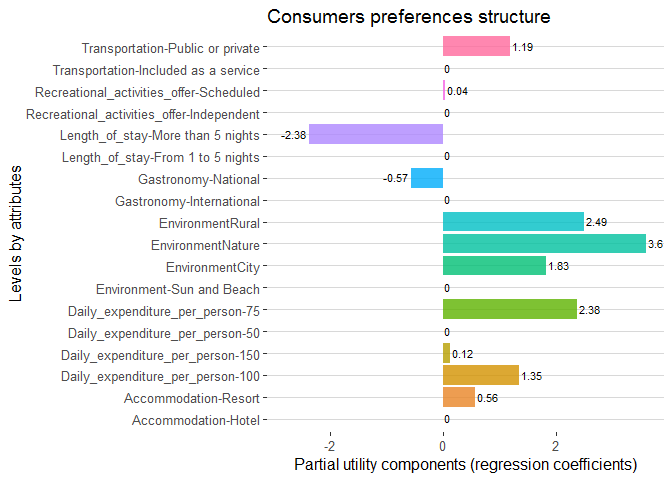
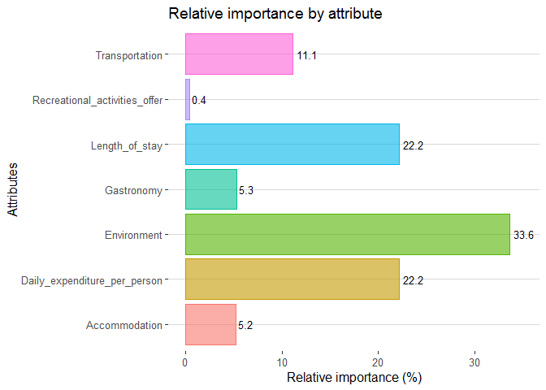
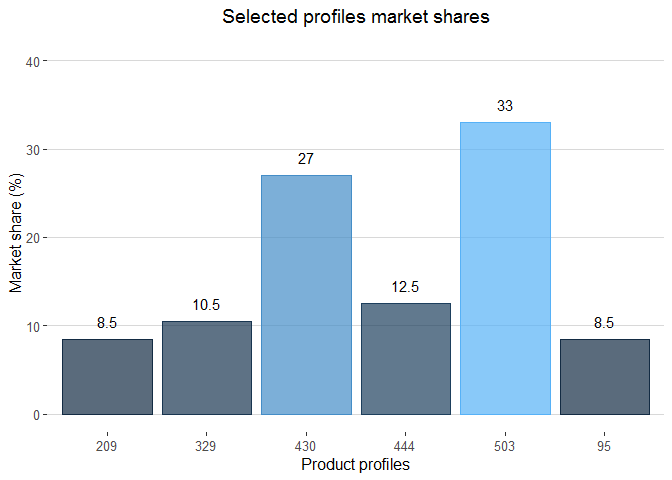

How do products attributes influence consumer choices
================

The objective of this project is to apply a methodology aimed at
estimating the contribution of the attributes of any product to the
potential consumers choices. The methodology selected for this purpose
is the Rating – Based Conjoint Analysis and through this project you can
find an example were I evaluated the influence of seven factors
(attributes) in the potential choices at tourist market. However, the
codes proposed for the analysis and visualizations allow to determine
and show the structure of consumer preferences in any market under
study, both at an aggregated level and through market segmentation.

## Simulating ratings-based conjoint data

For this project, I used real data from a survey applied to tourism
products consumers. However, in order to understand the structure of the
data used in this type of analysis, I simulate responses for a
hypothetical conjoint analysis survey with 400 respondents who each rate
the same set of 16 product profiles. The results shown are based on
simulated data for the tourism sector and are presented as an example of
the use of rating-based conjoint.

## Codes used

-   Simulating data
-   Multiple regression analysis (aggregated level)
-   Multiple regression analysis (regarding segmentation)
-   Predicting market shares

## Data visualization examples

The estimated preference structure for the entire sample can be observed
in the graph below and analyzed through the values achieved by the
partial components of utility (coefficients estimated in the aggregate
model). Positive coefficients means a positive contribution from this
level to the total utility achieved when choosing a tourism product and
coefficients with a negative sign just the opposite. For this reason,
the sign shown by each coefficient shows whether a level increases or
decreases the total utility of a tourism product.

<!-- -->

The following plot shows the relative importance of each attribute in
the consumers choices.

<!-- -->

By using a mixed model, resulting from the addition of the coefficients
obtained from the estimation at aggregate level (fixed effects) and the
coefficients estimated at the level of each individual (random effects),
heterogeneity can be introduced to the model. Through a mixed model the
market share of any set of product profiles can be calculated. The
following plot shows the values of market shares of six product profiles
(combinations of attributes included in the analysis), calculated by the
maximum utility method.

<!-- -->
